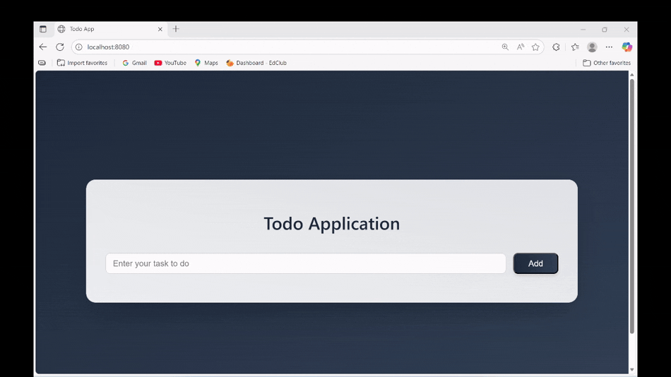

# 📝 Todo Application

A simple and elegant **Task Management Web App** built with **Java Spring Boot**, **Thymeleaf**, and **MySQL** following the **MVC architecture pattern**.

This project demonstrates full-stack development using the Spring ecosystem — from backend logic and data persistence to a responsive front-end interface powered by Thymeleaf templates.

---

## 🎬 Demo

<p align="center">
  
</p>

---

## 🚀 Features

- ➕ Add, edit, and delete todos  
- ✅ Mark tasks as completed  
- 🧩 Data persistence using MySQL + JPA/Hibernate  
- 🎨 Dynamic UI with Thymeleaf templates  
- ⚙️ MVC structure promoting clean, maintainable code  

---

## 🧱 Tech Stack

| Layer | Technology |
|-------|-------------|
| Backend | **Java**, **Spring Boot** |
| Frontend | **Thymeleaf**, **HTML5**, **CSS3** |
| Database | **MySQL** |
| ORM | **Spring Data JPA / Hibernate** |
| Build Tool | **Maven** |
| IDE | IntelliJ IDEA / VS Code / Eclipse |

---

## 🧩 Project Structure

```
todo-app/
├── src/
│ ├── main/
│ │ ├── java/com/example/todo/
│ │ │ ├── controller/ # Handles HTTP requests
│ │ │ ├── service/ # Business logic layer
│ │ │ ├── repository/ # Data access layer (JPA Repositories)
│ │ │ ├── model/ # Entity classes (JPA)
│ │ │ └── TodoAppApplication.java
│ │ └── resources/
│ │ ├── templates/ # Thymeleaf HTML templates
│ │ ├── static/ # CSS / JS / images
│ │ └── application.properties # DB configuration
│ └── test/
│ └── java/com/example/todo/
│ └── TodoAppApplicationTests.java
├── demo/
│ └── demo.gif # App demo preview
└── pom.xml # Maven dependencies
```

---

## ⚙️ Installation & Setup

### 1. Clone the repository
```bash
git clone https://github.com/tsiory17/todo-app.git
cd todo-app
```

### 2. Configure your MySQL database
Create a new database in MySQL:
```sql
CREATE DATABASE todo_db;
```

Then edit your `application.properties`:
```properties
spring.datasource.url=jdbc:mysql://localhost:3306/todo_db
spring.datasource.username=YOUR_USERNAME
spring.datasource.password=YOUR_PASSWORD

spring.jpa.hibernate.ddl-auto=update
spring.jpa.show-sql=true
spring.jpa.properties.hibernate.dialect=org.hibernate.dialect.MySQLDialect
```

### 3. Build and run the application
```bash
mvn spring-boot:run
```

### 4. Open in browser
Visit:  
👉 **http://localhost:8080**

---

## 🧠 Concepts Demonstrated

- Model–View–Controller (MVC) architecture  
- Spring Boot dependency injection & bean management  
- CRUD operations with JPA and MySQL  
- Server-side rendering with Thymeleaf  
- Form handling and validation  

---
